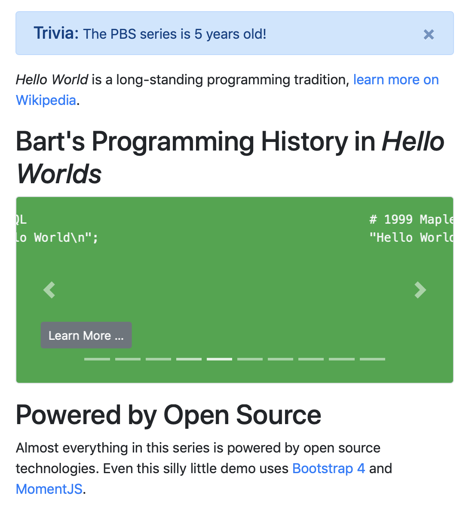
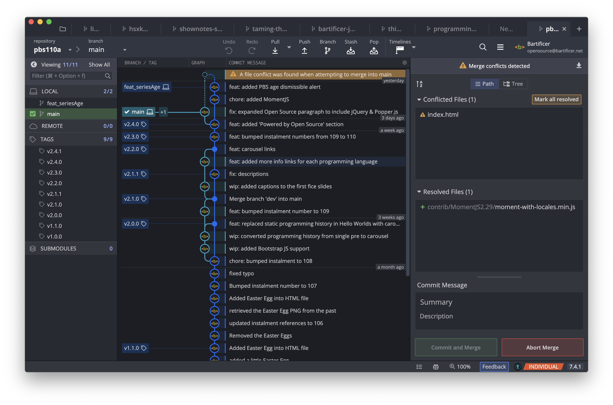
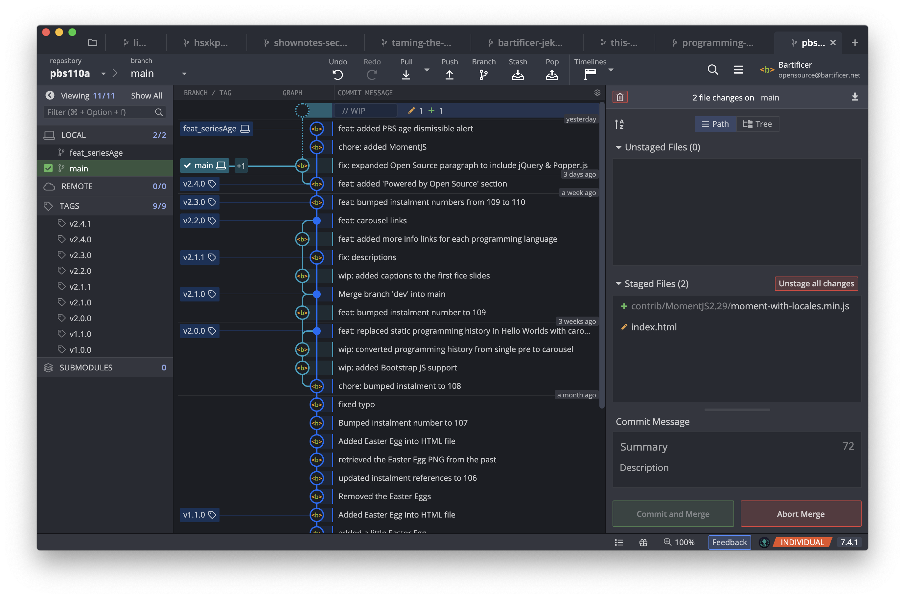

# PBS 110 of X — Merge Conflicts

As our branching strategy has evolved it's sprouted ever more simultaneously edited branches. The more branches under active development, the greater the chances of merge conflicts. Up to this point I've been very careful with how I've structured the examples to avoid conflicts, but in this instalment I've done the opposite, and intentionally engineered the example to create a conflict which we can then resolve!

## Matching Podcast Episode

TO DO

## Instalment Resources

* The instalment ZIP file — [pbs110.zip](https://github.com/bartificer/programming-by-stealth/raw/master/instalmentZips/pbs110.zip).

## Playing Along 

If you'd like to play along with the examples you'll need to download this instalment's ZIP file and unzip it. Open a terminal and change into the folder you extracted the ZIP into. You'll find a file in there named `pbs110a.bundle`, this is a bundled version of the repository we created in the previous instalment, with some additional commits added to prepare the ground for a merge conflict. We'll look at these commits in detail later.

Like we did in the previous two instalments, we need to make a new repository and import all the branches and tags from the bundle. We'll name our new repository `pbs110a`. To create this new repo we'll take the following steps:

1. create a folder named `pbs110a`
2. change into that folder
3. initialise it as a Git repo
4. if needed, change the default branch from `master` to `main`
5. import all branches and tags from the bundle into our new repository

The commands to do all this are

```
mkdir pbs110a
cd pbs110a
git init
[ `git symbolic-ref --short HEAD` = 'master' ] && git checkout -b main
git fetch --update-head-ok ../pbs110a.bundle '*:*'
git checkout main
```

## A Quick Recap on Merging Branches

The `git merge` command is used to integrate the changes on another branch into the currently checked out branch. This means that to merge a dev branch into the `main` branch you must have the `main` branch checked out.

If you want to avoid errors, be sure your working copy is clean before you try to merge.

As we've seen already, Git does a good job of automatically merging changes, but, that's not always possible. When the same line is edited on both branches some form of human judgement is needed to figure out what to keep, what to discard, or, how to merge the two versions into some sort of unified new whole.

When Git hits a conflict it asks its human masters for help! Git will pause the merge and mark the affected file(s) as being conflicted. At that point a human has to look at each conflict, resolve it, and then tell Git to continue with the merge.

There is also the *run away* option — you can reverse the conflicted merge and get back to a clean working directory just like it was before the doomed merge was started!

## Resolving Merge Conflicts — A Worked Example

If you open `index.html` in our newly restored `pbs110a` repo in both your browser and favourite text editor you'll see that there have been two changes on the `main` branch since the end of the previous instalment:

1. The instalment numbers have all been bumped from 109 to 110.
2. A new *'Powered by Open Source'* section has been added consisting of a header and a paragraph that list the open source libraries the dummy page uses.

The paragraph of text on the `main` branch states:


This is correct but not complete, since Bootstrap 4 uses both jQuery & Popper.js, the paragraph really should mention that, so, there's a fix for this sitting in a branch named `fix_missingOS`. Let's check that out and have a look:

```
git checkout fix_missingOS
```

On this branch the paragraph correctly states:


Simultaneous to this bug fix I also added a new feature to the page — a Bootstrap alert to show the age of the PBS series. The age is calculated using the Moment.js open source library. The work for this new feature is on the new branch `feat_seriesAge`. Let's check that branch out and have a look:

```
git checkout feat_seriesAge
```



The alert shows that as I type this the series is about 5 years old, but that's not the only change on the page. Moment.js is an open source project, so the paragraph about open source has also been updated to read:

> Almost everything in this series is powered by open source technologies. Even this silly little demo uses Bootstrap 4 and MomentJS.

### Before the Merge

Let's take a moment to understand where we are before we try to merge these two branches into `main` one after the other.

Both the fix and feature branch branched off `main` when the open source paragraph only referenced Bootstrap. This same line of text has been edited on both branches, and now we need to bring both changes into `main`.

This is how GitKraken diagrams the repository at this point:


### Merge the Fix Branch

The fix is nice and easy, so I finished that before I finished the feature, so in the real world I would have merged it first, so let's do that now. 

For completeness I'm going to tag the merged commit with a new version number following the SemVer convention described in the previous instalment. Note that since the merging change is a fix, and the current version is 2.4.0, the new version will be 2.4.1. Again, for completeness, I'll also delete the now obsolete fix branch. Finally, remember that you need to be on the branch you wish to merge into, so we need to start by switching back to` main`:

```
bart-imac2018:pbs110a bart% git checkout main
Switched to branch 'main'
bart-imac2018:pbs110a bart% git merge fix_missingOS
Updating 275f564..b45a1e4
Fast-forward
 index.html | 2 +-
 1 file changed, 1 insertion(+), 1 deletion(-)
bart-imac2018:pbs110a bart% git tag v2.4.1
bart-imac2018:pbs110a bart% git branch -d fix_missingOS
Deleted branch fix_missingOS (was b45a1e4).
bart-imac2018:pbs110a bart%
```

As you can see, Git was able to merge these changes automatically, so no conflict, and because there had been no commit on `main` between the branching point for the `fix_missingOS` branch and the merge point, Git chose a fast-forward merge.

### Merge the Conflicting Feature Branch

Now let's try merge the feature branch. Again, we'll clean up after ourselves, and, we'll tag with a new version number. Since this is a new feature rather than a fix, the version number will go from 2.4.1 to 2.5.0. Finally, since we want to merge into `main`, and since we're already on `main`, we don't need to do another checkout before we merge:

```
bart-imac2018:pbs110a bart% git merge feat_seriesAge
Auto-merging index.html
CONFLICT (content): Merge conflict in index.html
Automatic merge failed; fix conflicts and then commit the result.
bart-imac2018:pbs110a bart%
```

As expected (and planned), we have a merge conflict in `index.html`. Note that the terminal output very clearly tells you that there's a conflict, and which file or files are conflicted.

The repository has now entered a special state, the merge has started, but not completed, so the working copy is in a kind of limbo between the before and after universes. We now need to work through each conflict and resolve it before we can complete the merge and move beyond this limbo state back into a clean working copy. There's no limit on how long your repository can stay in this state. If you were merging a huge change in a massive project you might have hundreds of conflicts to resolve, so you could spend weeks in this state!

You can see that you are in this conflict state at any time with the `git status` command:

```
bart-imac2018:pbs110a bart% git status
On branch main
You have unmerged paths.
  (fix conflicts and run "git commit")
  (use "git merge --abort" to abort the merge)

Changes to be committed:

	new file:   contrib/MomentJS2.29/moment-with-locales.min.js

Unmerged paths:
  (use "git add <file>..." to mark resolution)

	both modified:   index.html

bart-imac2018:pbs110a bart% 
```

The way Git tells us that we're in the conflicted limbo state is by saying we have *unmerged paths*. The same terminology is used as the heading for the list of files that have conflicts, in this case it's a list of one, `index.html`.

GUI apps can choose to be very explicit in how they show a conflicted state. As an example, this is how GitKraken currently shows the repo:



Notice the exclamation point and orange banner to draw your attention to the conflict. Also notice that the partially completed merge is show on the timeline as a dashed line. Finally, notice that what would normally be the button to stage changes has now become a button to *Mark as Resolved*, and the commit button has split in two, become a button to *Commit and Merge*, and one to *Abort Merge*.

### Aborting a Merge

 Notice that the output from `git status` very conveniently tells us how to abort a conflicted merge — *'use "git merge --abort" to abort the merge'*.
 
It's important to remember how easy it is to *run away*, so let's do that and abort the merge:

```
bart-imac2018:pbs110a bart% git merge --abort
bart-imac2018:pbs110a bart%
```

No fanfare, not even any output, it's simply as if the merge was never even attempted! The `git status` command shows all is normal again:

```
bart-imac2018:pbs110a bart% git status
On branch main
nothing to commit, working tree clean
bart-imac2018:pbs110a bart% 
```

### Resolving a Merge Conflict

OK, so now that we know how easy it is to back out at any time, let's try actually resolve this conflict! Let's start by attempting the merge again, and getting back into our limbo state:

```
bart-imac2018:pbs110a bart% git merge feat_seriesAge              
Auto-merging index.html
CONFLICT (content): Merge conflict in index.html
Automatic merge failed; fix conflicts and then commit the result.
bart-imac2018:pbs110a bart%
```

We now know there's a conflict in `index.html`, how are we supposed to resolve it?

What Git has done is put both versions of the conflicted section (or sections) into the working copy of the file, but delimited them with special lines of text.

The start of a conflicted region is marked with:

```
<<<<<<< HEAD
```

After this special line the version of the conflicted section from the branch being merged into is included.

Next Git inserts a divider line:

```
=======
```

After the divider the version of the conflicted section from the branch being merged,  `feat_seriesAge` in this case, is included.

Finally, Git marks the end of the conflicted section with another special line of the form:

```
>>>>>>> feat_seriesAge
```

Note that's the name of the branch being merged at the end of the line, so it will change each time.

Git-aware code editors can detect these conflict markers and add enhanced UI of their own around them. This is how the conflicted section looks in VS Code:


Our task is simple, replace that entire conflicted section, **including the special lines** with the content we want to go into the merged commit.

In our case we need to write a single sentence that encapsulates the information in both versions, so you should open `index.html` in your favourite editor and replace:

```
<<<<<<< HEAD
<p>Almost everything in this series is powered by open source technologies. Even this silly little demo uses <a href="https://getbootstrap.com/docs/4.5/getting-started/introduction/" target="_blank" rel="noopener">Bootstrap 4</a>, and by extension <a href="https://jquery.com/" target="_blank" rel="noopener">jQuery and <a href="https://popper.js.org/" target="_blank" rel="noopener">Popper.js</a>.</p>
=======
<p>Almost everything in this series is powered by open source technologies. Even this silly little demo uses <a href="https://getbootstrap.com/docs/4.5/getting-started/introduction/" target="_blank" rel="noopener">Bootstrap 4</a> and <a href="https://momentjs.com/" target="_blank" rel="noopener">MomentJS</a>.</p>
>>>>>>> feat_seriesAge
```

With:

```
<p>Almost everything in this series is powered by open source technologies. Even this silly little demo uses <a href="https://momentjs.com/" target="_blank" rel="noopener">MomentJS</a>, <a href="https://getbootstrap.com/docs/4.5/getting-started/introduction/" target="_blank" rel="noopener">Bootstrap 4</a>, and by extension <a href="https://jquery.com/" target="_blank" rel="noopener">jQuery and <a href="https://popper.js.org/" target="_blank" rel="noopener">Popper.js</a>.</p>
```

We now need to tell Git that we've resolved this conflict, we do that by staging the file like we would any changed file (with `git add`):

```
git add index.html 
```

If we do a fresh `git status` we can see that we're still in our limbo state, but all the conflicts are now resolved:

```
bart-imac2018:pbs110a bart% git status 
On branch main
All conflicts fixed but you are still merging.
  (use "git commit" to conclude merge)

Changes to be committed:

	new file:   contrib/MomentJS2.29/moment-with-locales.min.js
	modified:   index.html

bart-imac2018:pbs110a bart%
```

The conflict warnings have also vanished in GitKraken:



Like Git kindly tells us, we can now use `git commit` to complete the merge:

```
bart-imac2018:pbs110a bart% git commit -m 'feat: added an alert with the age of the series'
[main 74d6dd0] feat: added an alert with the age of the series
bart-imac2018:pbs110a bart% 
```

Next we can tag our new release and delete our obsolete branch:

```
bart-imac2018:pbs110a bart% git tag v2.5.0
bart-imac2018:pbs110a bart% git branch -d feat_seriesAge
Deleted branch feat_seriesAge (was 9890fb8).
bart-imac2018:pbs110a bart% 
```

That's all there is to it, we've now successfully navigated one of those dreaded merge conflicts!

We can see that all's normal on the terminal:

```
bart-imac2018:pbs110a bart% git status
On branch main
nothing to commit, working tree clean
bart-imac2018:pbs110a bart%
```

And in GitKraken we can visually see that the branches have been successfully merged:


## Final Thoughts

Hopefully this instalment has cured you of any fear you may have had of merge conflicts. It turns out they're easy to back out of, or, to resolve, which ever you wish.

Something you may have noticed in recent instalments is my regular use of the word *before* while describing things you should do. Things like *"before you start making your changes, create a new feature or fix branch"*, *"don't forget to checkout the right branch before adding new files"*, *"remember you have to have a clean working copy before you can merge"* ... and so on. These *befores* require we humans to remember things, and we humans are terrible at that! It's inevitable that as you use Git you'll forget one of these *befores* and start making edits in the wrong place. I do it all the time, and so will you! Thankfully, Git provides a mechanism for dealing with these situations — *stashes*, and we'll learn about those in the next instalment.