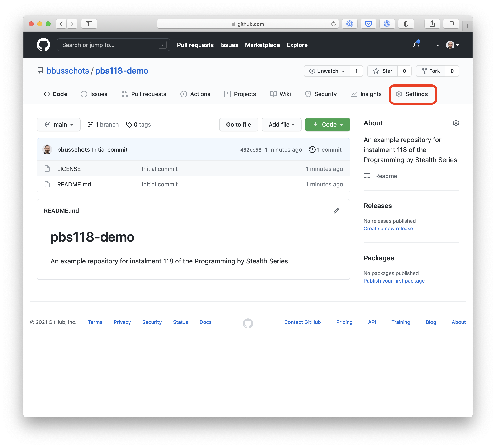
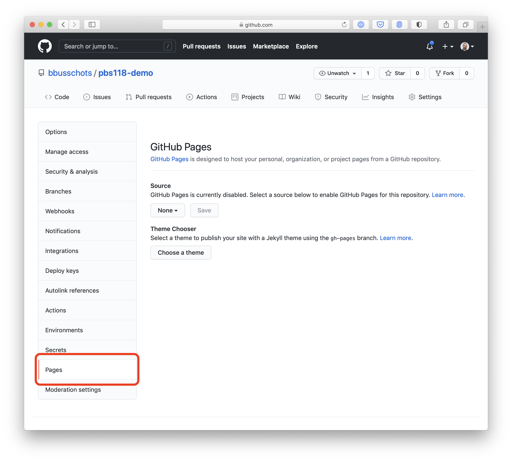
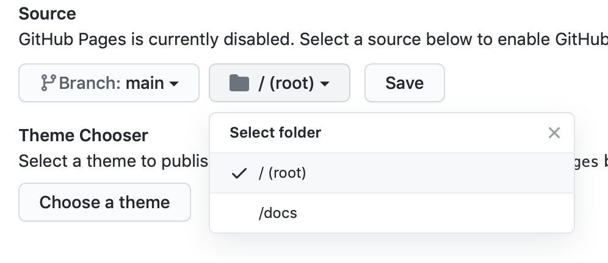
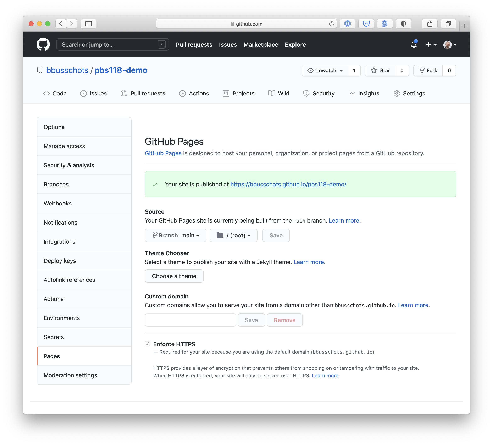
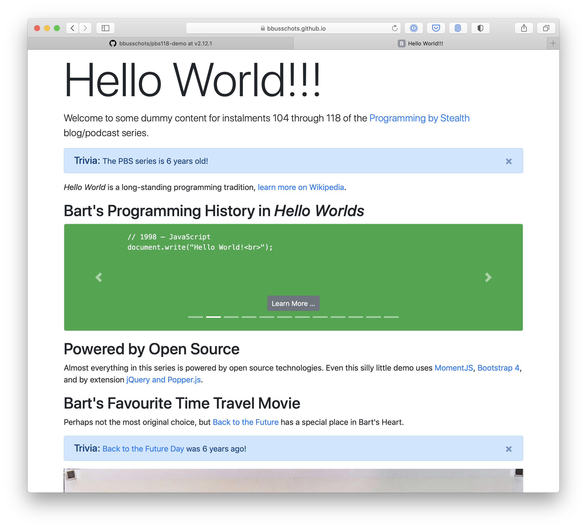

# PBS 118 of X — JavaScript Apps with GitHub Pages

Before we finish our look at Git and GitHub by learning how to interact with the open source community, let's take a little detour into one of GitHub's nicest little bonus features — GitHub Pages. Basically, GitHub pages gives you free basic web hosting managed with Git!

GitHub Pages is not a LAMP stack (Linux, Apache, MySQL, PHP), so you can't run server-side web apps like Wordpress or Drupal on it, but it's still a very useful and powerful free tool. It's generally used for one or more of the following:

1. To host a project's home page
2. To host the documentation for the code in a repository
3. To host a live, working version of a client-side (HTML + CSS + JavaScript) web app

It's the third option that's of most interest to us in this series — allowing us to host apps developed using any of the tools we've encountered to date in this series!

## Matching Podcast Episode

Listen along to this instalment on [episode 688 of the Chit Chat Across the Pond Podcast](https://www.podfeet.com/blog/2021/06/ccatp-688/).

<audio controls src="https://media.blubrry.com/nosillacast/traffic.libsyn.com/nosillacast/CCATP_2021_06_12.mp3?autoplay=0&loop=0&controls=1">Your browser does not support HTML 5 audio 🙁</audio>

You can also <a href="https://media.blubrry.com/nosillacast/traffic.libsyn.com/nosillacast/CCATP_2021_06_12.mp3" >Download the MP3</a>

## Static Sites -v- Static Site Generators -v- Dynamic Sites

By default, GitHub Pages is a static site generator, so let's take a moment to understand what that means.

Browsing to a web page involves the following steps (broadly speaking):

1. The browser sends a request to a web server for a specific URL
2. The web server figures out the appropriate HTML for that URL
3. The web server returns the HTML to the browser
4. The browser renders the HTML

Step 2 is where the real work happens — How does the web server figure out the appropriate HTML for a URL? This is where the difference between static and dynamic websites lie, and, where there's room for a strange kind of neither fish-nor-foul in between option — static site generators.

To really understand this stuff you have to realise that there's two relevant points of view — the developer's POV, and the web server's POV.

Developers care about whether they write the HTML directly, or whether they write code that generates HTML somehow.

Web servers care about whether the HTML is simply there for the taking, or, if they have to execute some code to get it.

### Static Sites

Static sites are at the simple end of the spectrum — developers write the HTML directly, and web servers read the HTML from a file and simply return it to the browser as they found it.

This is known as *static content* because every browser accessing the same URL anywhere in the world gets the same content. Until the developer uploads a new file, the HTML the URL maps to does not change.

Everything we've done to date in this series is static content.

### Dynamic Sites

Dynamic sites sit at the other end of the spectrum – developers write code which somehow produces HTML, and web servers have to execute that code each and every time they get a request for the URL.

This is called *dynamic content*, because depending on what the code does, every request could result in completely different HTML.

This is how what we loosely call *web 2.0* works — when I go to Twitter I see my timeline, not yours, but our browsers are at the same URL, and the web server is executing the same code. The difference comes about because of different inputs — my browser handed the server a different session cookie to yours, so I get different HTML to you.

> Aside — we're about to enter the world of dynamic content in this series. The most popular so-called *server side* language used to create dynamic web pages is PHP, and that's where this series is headed.
{: .aside}

### Static Site Generators (SSGs)

Static site generators provide an interesting middle ground by adding a third player into the game.

The developer writes code that gets translated to HTML by the static site generator, this generated HTML is then uploaded to the web server as static HTML files, and the web server serves it as static content.

So, from the developer's POV, they are writing code that gets translated into HTML, but from the server's POV it serves out static HTML.

Writing a site with a static site generator sits somewhere on a spectrum between writing almost pure HTML with just a few added extras that the static site generator converts to HTML, and not writing a single line of HTML and having it all generated by the static site generator.

A common example of the former are static site generators with support for template tags similar to [Mustache](https://github.com/janl/mustache.js/), and a common example of the latter are static site generators that take Markdown code as input to produce the HTML output.

## GitHub Pages and Jekyll

GitHub Pages are static sites generated using the free and open source [Jekyll](https://jekyllrb.com) static site generator (SSG).

The process works like this:

1. Code is committed to the defined source for the GitHub Pages site via Git
2. The code is processed by Jekyll to generate a static website
3. The resulting static website is published on a web server provided by GitHub

What makes Jekyll such a good fit for GitHub Pages is that it's extremely flexible. If you write a pure HTML site and run it through Jekyll it comes out utterly un-changed, so you can use GitHub pages as if it was just a regular web server hosting static content. On the other hand, if you use Jekyll-specific features, you can create a GitHub Pages site without writing a single line of HTML!

By default, GitHub Pages copies HTML files directly from your repo to the published site un-changed, and converts Markdown files to HTML using Jekyll.

We're not going to be learning about Jekyll in this series, but if you want to learn more about it, I'm including some useful links a little later in the instalment.

### GitHub Pages' Specifics

I've already said that a GitHub pages site is powered by Jekyll, but there's a little more to it than that. GitHub have chosen to expand Jekyll by adding additional features of their own. So, while any Jekyll site can be published on GitHub Pages, not every GitHub Pages site can be rendered by the regular version of Jekyll.

One of the additions GitHub added was a default theme of their own making which they use for rendering Markdown files. I find it a very tasteful theme, but it's a little too plain for some people's liking. 🙂 Thankfully GitHub doesn't just provide a default theme, it also provides a gallery of more opinionated themes to choose from. And, if you're prepared to get a little more in the weeds and edit Jekyll config files, GitHub Pages even provides the ability to design your own theme from scratch, or, link to any other theme hosted on a publicly accessible Git server.

GitHub also partnered with [Let's Encrypt](https://letsencrypt.org) to make HTTPS available on all GitHub Pages sites free of charge.

By default, GitHub Pages sites are published under the `github.io` domain. For example, the GitHub Pages URL for a repo named `boogers` belonging to a user with the username `smartypants` would be published at `https://smartypants.github.io/boogers`. However, if you own your own domain and are happy to add a simple DNS record, you can publish a GitHub Pages site on your own domain (or subdomain).

Since this series moved from my personal blog to its current home, [pbs.bartificer.net](https://pbs.bartificer.net/), it's been published using GitHub Pages! This text you're reading now was written in Markdown and it gets converted to HTML by Jekyll each time a change is committed to the `master` branch (the repo pre-dates the switch to `main` as the default).

Because this series, like pretty much everything I do outside of my day-job, is open source, you can view the source for this site in the `docs` folder in the [`programming-by-stealth` repo](https://github.com/bartificer/programming-by-stealth). I've also released the custom theme I developed as open source via the [`bartificer-jekyll-theme` repo](https://github.com/bartificer/bartificer-jekyll-theme).

### GitHub Pages & Jekyll Resources

If you're interested in learning more about GitHub Pages, Jekyll, or Liquid, you might find some of these links helpful:

* The official Jekyll documentation — [jekyllrb.com/…](https://jekyllrb.com/docs/)
* Jekyll uses the [Liquid](https://shopify.github.io/liquid/) templating engine (released as open source by Shopify), so to get the most out of it you need to be familiar with that too the relevant documentation is refer to as being *for designers* — [github.com/…](https://github.com/Shopify/liquid/wiki/Liquid-for-Designers)
* The GitHub Pages documentation — [docs.github.com/…](https://docs.github.com/en/pages)
* GitHub's Markdown documentation — [guides.github.com/…](https://guides.github.com/features/mastering-markdown/)

## Enabling GitHub Pages

GitHub Pages is an optional feature on every GitHub repo, and there's a section for controlling it in the repo settings page. 

Start by opening the repository's settings page:



Then choose *Pages* from the menu:



To get started we have to choose a source for the site's files. The first step is to pick a branch, then, GitHub will give you two choices — use all the files on that branch as the source for the website, or, use the contents of the top-level `docs` folder:



As a general rule, if the point of the website is to be an added-extra to a project, such as a home page and/or a documentation page, then choose `/docs`, otherwise, if the purpose of the repo is to be the source code for the site, use the root folder (`/`).

Once you've chosen a source and saved it, you'll get a notification of the site's URL, and additional options will appear.



You'll notice that if you don't use a custom domain, HTTPS is on, and you don't get a say in the matter — the checkbox to turn it off is disabled!

If you own a domain and want to use it, or, a subdomain, simply enter it in the custom domain field, and then add the DNS CNAME record it will instruct you to add.

## A Worked Example

As a practical example, I resurrected the *Hello World* example we've been using in various instalments since instalment 104, and published it using GitHub Pages.

I stated by creating a new repository in my GitHub account (`bbusschots`) which I named `pbs118-demo`. I added a README and a license, and then enabled GitHub Pages and set it to use the root of the `main` branch as the site's source.

That resulted in a mostly empty site (other than the README and the License) being published to [bbusschots.github.io/pbs118-demo](https://bbusschots.github.io/pbs118-demo/).

I was planning to get creative and come up with a whole new silly web app to use as an example, but then I realised that would be a complete waste of time, so instead I decided to resurrect our most recently used example as we left it at the end of instalment 115.

I could have cloned the new repo, copied in the files, and then pushed the updated repo, but that wouldn't capture any of the change history, and frankly, overly convoluted — with Git there's a simpler way. 🙂

I still had the bare repo (`pbs115a-nas.git`) on my Mac, so I simply changed into it, added a new remote named `pbs118GitHub`, fetched, then forced a push, replacing the place-holder content in the new repo with the entire history of the local repo's `main` branch. I chose to force a push because I really did want to replace the placeholder content rather than merging it with the local branch. By default Git won't allow destructive changes, I had to use `--force` because the action I wanted to do was to replace the entire `main` of the remote repo, replacing what was there before.

Anyway, here's my terminal output for all that:

```
bart-imac2018:pbs115 bart% cd pbs115a-nas.git 
bart-imac2018:pbs115a-nas.git bart% git remote add pbs118GitHub git@github.com:bbusschots/pbs118-demo.git
bart-imac2018:pbs115a-nas.git bart% git fetch
From /Users/bart/Documents/Temp/pbs115/pbs115a.bundle
 * branch            HEAD       -> FETCH_HEAD
bart-imac2018:pbs115a-nas.git bart% git push pbs118GitHub main --force
Total 0 (delta 0), reused 0 (delta 0)
To github.com:bbusschots/pbs118-demo.git
 + 482cc58...aa8a792 main -> main (forced update)
bart-imac2018:pbs115a-nas.git bart%
```

Notice it was just three short commands, and I could have done it all in one by directly including the URL in the push:

```
git push git@github.com:bbusschots/pbs118-demo.git main --force
```

Once the PBS 15 code was force-pushed I used the GitHub web GUI to quickly change the instalment numbers in `README.md` and `index.html`  and that was that! I had a working (but very dumb) web app at [bbusschots.github.io/pbs118-demo](https://bbusschots.github.io/pbs118-demo/)!



## Final Thoughts

We may re-visit GitHub Pages in more detail in future instalments when we're ready to start doing things like publishing automatically generated documentation sites, but for now, the key take-away is that you can use GitHub to publish your client-side web apps to the world for free!

We're now ready to wrap up our exploration of Git by looking at how we can use GitHub to interact with the open source community.
