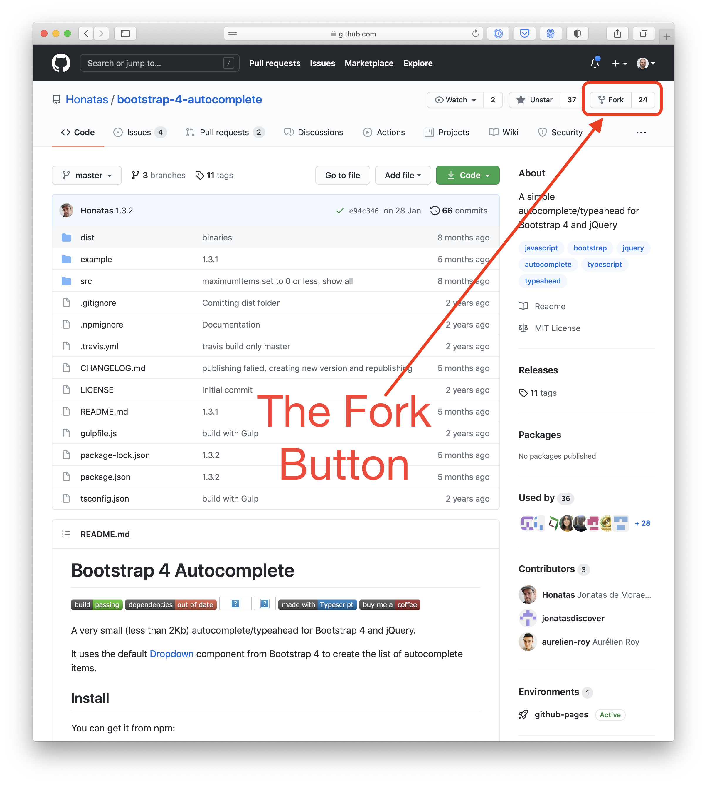
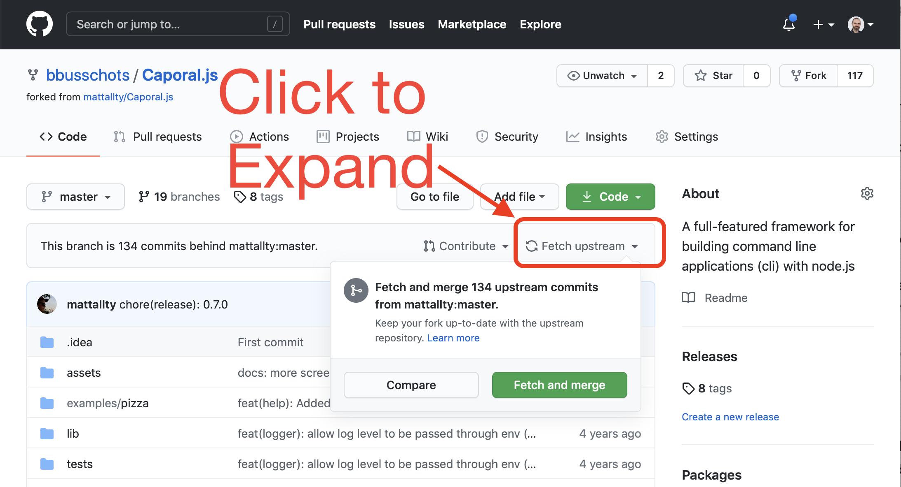
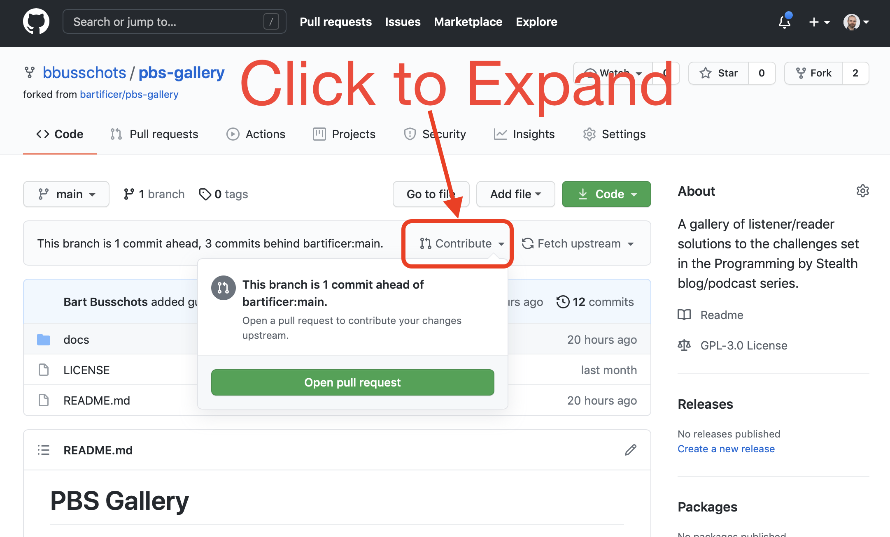
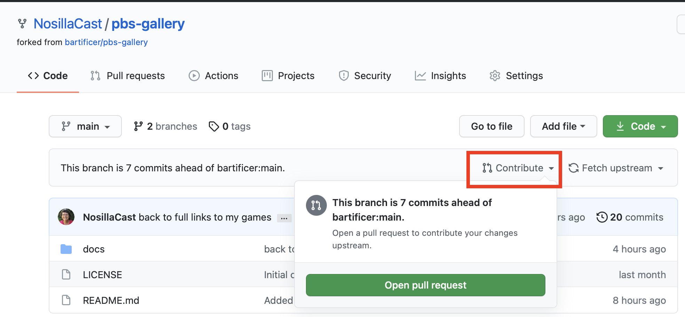
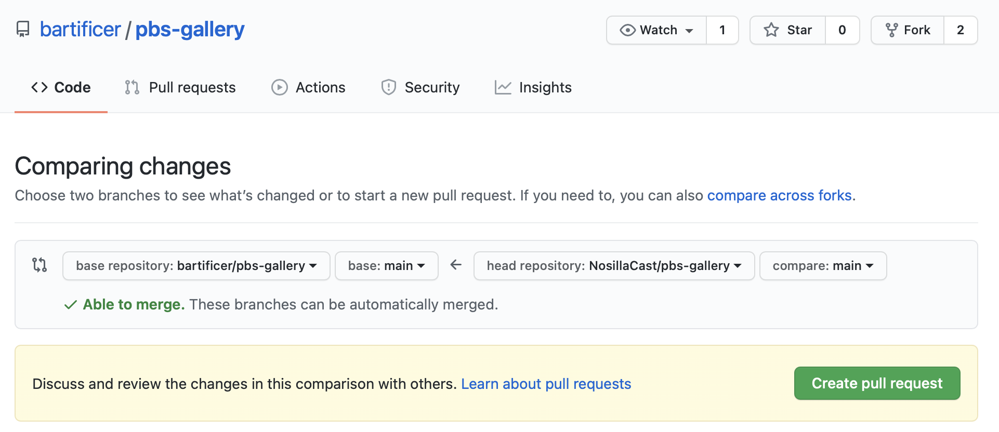

# PBS 119 of X — Open Source on GitHub

Our stated aim from the start of our exploration of Git has been to get to a stage where we could use Git to keep our own code safe and easily accessible, effectively collaborate within a closed group, and, finally, participate in the open source community.

We're nearly there!

We have the skills to manage our own code, and we have the skills to work within a closed group. All that's left is dipping our proverbial toe into the open source waters, and that's what this instalment is all about!

You can engage at different levels, so we're going to start with the most passive, and work our way towards the ultimate goal — contributing to an open source project. Next time you find a silly typo in these show notes, you'll have the skills to fix it 😉

Like with the previous two instalments, we're going to be looking exclusively at GitHub in this instalment. Again, my reason for picking GitHub is simple: they offer a good service across a wide array of pricing tiers, their free tier is really feature-rich, they have a track record of being good netizens, and probably not unrelatedly, many open source projects are hosted there.

Other hosted Git service providers like GitLab offer very similar functionality. While the broad concepts should appear familiar, the implementation details definitely differ.

## Matching Podcast Episode

Listen along to this instalment on [episode 690 of the Chit Chat Across the Pond Podcast](https://www.podfeet.com/blog/2021/06/ccatp-690/).

<audio controls src="https://media.blubrry.com/nosillacast/traffic.libsyn.com/nosillacast/CCATP_2021_06_25.mp3?autoplay=0&loop=0&controls=1">Your browser does not support HTML 5 audio 🙁</audio>

You can also <a href="https://media.blubrry.com/nosillacast/traffic.libsyn.com/nosillacast/CCATP_2021_06_25.mp3" >Download the MP3</a>

## Reminder — the Open Source Community is not a Team

Before we get stuck into the details, I want to re-iterate what makes the open source community different to a team of friends or co-workers (as described in [instalment 116](pbs116)). A team is a group of equals where everyone can push commits to, and pull commits from a shared repository. The open source community is more complex. Within a project there will be a core group of people with read and write access, the so-called *maintainers*, but many more people will want to access the code, and some will want to contribute fixes or enhancements to the code. Opening up read-access to the world is no problem, but write access? If you simply opened up your repository for anyone to push to you'd be hosting malware within minutes! Clearly, a better workflow is needed!

## Three Open Source Scenarios

We're going to look at three levels of interaction you can choose to have with an open source project hosted on GitHub:

1. You can use the code exactly as-is
2. You can use the code with a few customisations of your own
3. You can customise the code and contribute those customisations back to the project

## Scenario 1 — Use Code As-is (Just Clone it)

The simplest way to access open source code published on GitHub is to simply clone the repo! The URL is available right on a repository's home page, just click the **Code** button, choose your URL scheme, and paste into your favourite client or into a CLI Git command in your terminal.

There really is nothing more to it. Also, all other Git-hosting services that cater to the open source community will provide the same functionality, they'll just lay their interface out a little differently and they might use different names for the buttons.

Before moving on, I'd like to dwell on some things you may start to notice as you browse through open source repos. Most open source projects have some kind of build process to turn the code written by the developers into the final product used by the users. As a general rule, `README.md` should contain build instructions if they're needed.

A common convention in repos that require building is to include completed builds in the repo in a folder named `dist` (short for *distribution*). Generally the build in `dist` is only updated in commits that get tagged as releases, and by no means all projects choose to include builds in their repos at all.

Some projects (like [jQuery](https://github.com/jquery/jquery)), provide a `dist` folder that's effectively empty until you build the code yourself using the instructions in `README.md`. Others like [Bootstrap](https://github.com/twbs/bootstrap/tree/v4-dev) do provide full builds in their `dist` folder.

## Scenario 2 — Use Customised Code (Fork & Pull)

Simply using open source code exactly as-is is extremely powerful, but sometimes it doesn't quite meet your needs. It could be that there's a subtle bug that bothers you that's not getting fixed, or maybe a function that doesn't work quite as you'd like, or a function you think really should exist that doesn't, or whatever. The key point is that you want to tweak the code, but not lose out on future updates.

Without something like Git you would download the most recent snap-shot of the code, make your tweaks, and then use your tweaked version going forward. For the first while that's fine, but over time that solution gets worse and worse as the original code gets new features, bug fixes, or worse yet, security patches, and your custom version does not. Your code is getting staler and staler and staler as time goes by!

One approach to deal with this problem is to periodically reapply your changes to the current version of the original code. There are even tools to help you with that. For example, patch files created and applied using the the Linux command line tools [`diff`](https://man7.org/linux/man-pages/man1/diff.1.html) & [`patch`](https://man7.org/linux/man-pages/man1/patch.1.html). (If you're curious, [How to Geek has a guide](https://www.howtogeek.com/415442/how-to-apply-a-patch-to-a-file-and-create-patches-in-linux/).)

Patching is always fiddly in my experience, and the more changes you make, the more unmanageable the whole thing becomes.

Unsurprisingly, Git provides us with a solution that's actually practical — branching! Conceptually, you want a branch that tracks the official code, and a branch with your changes on it. Whenever there are changes you want in the official code, you merge the official branch into yours. If your changes are compatible with the official changes the merge will just happen, if not, you'll need to resolve the merge conflict, but Git provides a very good process for that (see [instalment 110](pbs110)), so even those worst-case scenarios are manageable.

We don't need GitHub to achieve this, we can do it using plain Git as follows:

1. Clone the official repo into our own infrastructure, say a headless Git repo on our NAS.
2. Clone our copy of the official repo to a development computer (implicitly creating a remote named `origin` pointing to the repo on the NAS).
3. Add a remote pointing to the official repo. This remote can have any name you like, but by convention developers tend to use `upstream`, so let's just do that
4. Make the desired changes on our repo's `main` branch and push our changes to our `origin` (on the NAS) as we work.
5. Each time we want to bring changes from the official repo into our version of the code, simply merge `upstream/main` into `main` using `git pull`, and push the merged changed to our `origin` (on the NAS).

### Forking

GitHub lets us collapse the first three steps into one single step it calls *forking*.

When you browse to a public repo on GitHub while logged in you'll see a button in the top-right with the label *Fork*, an icon that looks like splitting branches, and a counter. The counter shows how many times the repo has been forked, and the button lets you create your own fork.



When you fork a repo GitHub does the following:

1. Creates a new repo in your GitGub account
2. Clones the forked repo into your new repo
3. Adds a remote to your repo named `upstream` that points to the repo you forked

Because of that built-in `upstream` remote, your repo knows it is a *fork* of the original repo, so the icon will reflect that, and, more importantly, new functionality will appear in the GitHub interface to let you pull changes from the original repo into yours. (And, as we'll discover shortly, offer your changes back to the original repo too.)

If you clone your repo from GitHub to your coding computer using a GitHub-aware client you'll automatically get both the traditional `origin` remote, and, the `upstream` remote. 

As well as being able to update your fork using the `git pull` command, the GitHub web interface provides a nice UI to sync your fork with the upstream repository. On repos that are forks a button with a sync icon and a disclosure triangle labeled *Fetch upstream* appears near the top of the page. If you click on this a little popover will expand giving you buttons for merging upstream changes into your fork:



You don't have to use the GitHub web interface to fork GitHub-hosted projects, you can use the `gh` GitHub terminal command.

To fork a repo it really is as simple as:

```
gh repo fork {{github_username}}/{{repo_name}}
```

Let's use as an example the Bootstrap Autocomplete library that we used in auto-filling the search box for the city names for our clocks:

```
gh repo fork https://github.com/Honatas/bootstrap-4-autocomplete
```

We would then make our changes in our fork, and over time, we would merge the changes from the official repo into our modified repo with:

```
git pull upstream master
```

Note that this repo is clearly a little older, because it has a `master` rather than a `main` branch.

## Scenario 3 — Contribute (Fork & Create Pull Requests)

The first step towards offering changes back to an open source project on GitHub is to make your changes on a fork of their repo. In other words, you start by just making the changes for yourself like in scenario 2, then, when you're ready, you take the plunge and offer your changes to the project.

At this point the changes you've made exist in a commit on your publicly accessible repository. In a purely Git world you would need to contact the open source project's maintainer by some means, and ask them to pull your commit into the official repo.

### Pull Requests

In the world of GitHub this process is simplified by removing the need for another communication channel — since both repositories are on GitHub, and both parties have GitHub accounts, GitHub can provide a nice human-friendly workflow right within the site (and via their `gh` CLI). Because this is a mechanism to ask a maintainer to pull your code, GitHub named the process a *pull request*, or PR for short.

If you browse one of your repos that's a fork on the GitHub website you'll see a button labeled *Contribute* (next to the *Fetch upstream* button). When you click this a little popover expands giving you a big green buttons to open a Pull Request (if you have no changes relative to the upstream repo the button will be disabled):



GitHub-aware clients can also provide UI elements for creating PRs, and you can use the `gh pr` CLI as well (see the worked example below or [the relevant section of the docs](https://cli.github.com/manual/gh_pr_create)).

Once you've made a PR it's up to the maintainer of the upstream repository to decide whether or not to merge your changes. On GitHub, PRs have an associated chat thread where maintainers and contributors can discus the proposed changes, and additional commits can be added to the PR to comply with the maintainer's wishes. Maintainers of the receiving repo can *merge* the changes, effectively accepting the changes, or, they can *close* the PR, effectively rejecting them. Commits submitted via a PR retain their original author information, so you'll get visible credit within the GitHub repo for your contributions.

Note that GitHub's terminology around pull requests can be a little confusing, especially the term *base*. Because you're requesting a pull, the base is the repository and you are offering your changes to, not the changes you are offering. Your repository is referred to as the *head repository* of the PR, and the branch on your repo you're offering to be pulled is referred to as the *compare*.

## The PBS Gallery — A Worked Pull Request Example

Many of you following along with this series have created some great web apps in response to the various challenges set throughout this series. Any of you who would like to show off your work can now do so via a GitHub-powered website, the PBS gallery at [gallery.pbs.bartificer.net](https://gallery.pbs.bartificer.net/).

### Submitting to the PBS Gallery

To submit a JavaScript-based web app to the gallery take the following steps:

1. Fork the [bartificer/pbs-gallery](https://github.com/bartificer/pbs-gallery) repo.
2. Add a folder named for your GitHub username in the appropriate place-holder folder in the `docs` folder, e.g. Allison could add her world clock to `docs/pbs92-world-clock/nosillacast`.
3. Add your code to your newly created folder.
4. Enable GitHub pages on your forked copy of the repo and verify that your code is working as expected. 
    * Set the branch to `main` and source to `docs`
    * The URL for your code will be the URL GitHubPages created for you followed by the path inside the `docs` folder. For Allison that would be `nosillacast.github.io/pbs-gallery/pbs92-world-clock/nosillacast/`.
5. Initiate a Pull Request with your changes.

## Worked Example — Adding my Number Guessing Game to the Gallery

As an example, here's how I added my number guessing game. Note that I chose to use the `gh` CLI since we've been concentrating on the command line throughout our exploration of Git.

Just for clarity, the official PBS Gallery is `bartifier/pbs-gallery` because [the Bartificer Creations GitHub Organisation](https://github.com/bartificer) owns the repo. `bbusschots/pbs-gallery` will be my fork of the official repo because [my personal GitHub](https://github.com/bbusschots) username is `bbusschots`.

### Forking, Editing & Creating a PR on the Command-line

Before starting to use the `gh` command it's a good idea to check that you're logged in from the command line, and as the right user to boot, this can be done with the `gh auth status` command:

```
bart-imac2018:Temp bart% gh auth status                
github.com
  ✓ Logged in to github.com as bbusschots (/Users/bart/.config/gh/hosts.yml)
  ✓ Git operations for github.com configured to use ssh protocol.
  ✓ Token: *******************
  
bart-imac2018:Temp bart% 
```

The next step is to fork the repo:

```
bart-imac2018:Temp bart% gh repo fork bartificer/pbs-gallery --clone=true
✓ Created fork bbusschots/pbs-gallery
Cloning into 'pbs-gallery'...
remote: Enumerating objects: 61, done.
remote: Counting objects: 100% (61/61), done.
remote: Compressing objects: 100% (49/49), done.
remote: Total 61 (delta 15), reused 33 (delta 1), pack-reused 0
Receiving objects: 100% (61/61), 66.67 KiB | 244.00 KiB/s, done.
Resolving deltas: 100% (15/15), done.
Updating upstream
From github.com:bartificer/pbs-gallery
 * [new branch]      main       -> upstream/main
✓ Cloned fork
bart-imac2018:Temp bart%
```

Note that I specified `--clone=true` to avoid the `gh` command asking me whether or not I wanted to clone my fork to my local machine. Also note that the fork was cloned to my Mac in a new folder named `pbs-gallery` in the current directory. To start using the fork, change into it:

```
cd pbs-gallery
```

My next step was to create the folder for my files. The appropriate place-holder is `docs/pbs82-guessing-game`, so I changed into it and created a folder named the same as my GitHub username:

```
bart-imac2018:pbs-gallery bart% cd docs/pbs82-guessing-game 
bart-imac2018:pbs82-guessing-game bart% mkdir bbusschots
```

At this stage I copied my files into the folder using the Finder.

With the files copied I was ready to commit and push my changes:

```
bart-imac2018:pbs82-guessing-game bart% git status
On branch main
Your branch is up to date with 'origin/main'.

Untracked files:
  (use "git add <file>..." to include in what will be committed)

	bbusschots/

nothing added to commit but untracked files present (use "git add" to track)
bart-imac2018:pbs82-guessing-game bart% git add bbusschots
bart-imac2018:pbs82-guessing-game bart% git commit -am 'added guessing game by Bart Busschots'
[main 21f9abc] added guessing game by Bart Busschots
 8 files changed, 680 insertions(+)
 create mode 100755 docs/pbs82-guessing-game/bbusschots/PBS-Logo.svg
 create mode 100755 docs/pbs82-guessing-game/bbusschots/index.html
 create mode 100644 docs/pbs82-guessing-game/bbusschots/view/confirmQuit.tpl.txt
 create mode 100644 docs/pbs82-guessing-game/bbusschots/view/gameGrid.tpl.txt
 create mode 100644 docs/pbs82-guessing-game/bbusschots/view/gameMessage.tpl.txt
 create mode 100644 docs/pbs82-guessing-game/bbusschots/view/gameWon.tpl.txt
 create mode 100644 docs/pbs82-guessing-game/bbusschots/view/guessPopover.tpl.txt
 create mode 100644 docs/pbs82-guessing-game/bbusschots/view/guesses.tpl.txt
bart-imac2018:pbs82-guessing-game bart% git push
Enumerating objects: 17, done.
Counting objects: 100% (17/17), done.
Delta compression using up to 4 threads
Compressing objects: 100% (14/14), done.
Writing objects: 100% (14/14), 9.55 KiB | 4.77 MiB/s, done.
Total 14 (delta 2), reused 0 (delta 0)
remote: Resolving deltas: 100% (2/2), completed with 2 local objects.
To github.com:bbusschots/pbs-gallery.git
   bfd4bed..21f9abc  main -> main
bart-imac2018:pbs82-guessing-game bart% 
```

At this stage I enabled GitHub pages on my fork using the branch `main` and the `docs` folder as the source. GitHub told me my fork would be at `https://bbusschots.github.io/pbs-gallery/`, so that meant my guessing game would be at `https://bbusschots.github.io/pbs-gallery/pbs82-guessing-game/bbusschots/`.

Once my game was working in my fork, I offered my changes as a PR. Note that if I had not used the `--base=` flag to specify the *base* to offer the PR to, the `gh` command would have given me a menu of possible options, which, confusingly, would have included my own fork (`bbusschots/pbs-gallery`). The correct base is the official repository, i.e. `bartificer/pbs-gallery`, so I specified that in the command:

```
bart-imac2018:pbs82-guessing-game bart% gh pr create --base=bartificer/pbs-gallery --title "PBS 82 by bbusschots" --body "Number Guessing Game by Bart Busschots"

Creating pull request for bbusschots:main into main in bartificer/pbs-gallery

https://github.com/bartificer/pbs-gallery/pull/4
bart-imac2018:pbs82-guessing-game bart% 
```

Once my PR was accepted, the solution went live! [gallery.pbs.bartificer.net/…](https://gallery.pbs.bartificer.net/pbs82-guessing-game/bbusschots/)

### Creating a PR via the GitHub Web Interface

While we were preparing to record the audio accompaniment to this instalment Allison used the web interface to initiate a pull request and captured some screenshots.

Before starting Allison made sure all her changes had been pushed from her computer to her fork on GitHub. When then opened the repo in GitHub and clicked the *Contribute* button to start the process:



Notice that Allison made 7 commits while adding her number guessing game. Allison then pushed the *Open pull request* button which brought her to a screen showing the details of the PR, and allowing her to edit some of those if she wished. Specifically she could specify where to send the PR to (the *base*), which repo to make the PR from (the *head repository*), which branch to make the PR from (the *compare*):



 All these inputs were pre-filled with the appropriate values, so Allison just clicked the big green *Create pull request* button. This then took Allison to one final screen where she could enter a title and a description for her PR:


Finally, when she'd entered all the details she created the PR by clicking the big green *Create pull request* button.

Once I accepted the PR, Allison's game went live at [gallery.pbs.bartificer.net/pbs82-guessing-game/nosillacast/](https://gallery.pbs.bartificer.net/pbs82-guessing-game/nosillacast/). (Allison also added her time sharing clock at [gallery.pbs.bartificer.net/pbs96-time-sharing/nosillacast/](https://gallery.pbs.bartificer.net/pbs96-time-sharing/nosillacast/)).

## Final Thoughts

We're almost done with our exploration of Git now. We've arrived at our desired destination — we're ready to take part in the open source world! From now on, when you spot a typo in these show notes, you can fix it for me and submit a Pull Request 🙂

The reason I said we were *almost* done, and not actually done, is that we've accidentally forgotten something important — how to tell Git to ignore temporary files! We'll rectify that oversight in the next instalment.

