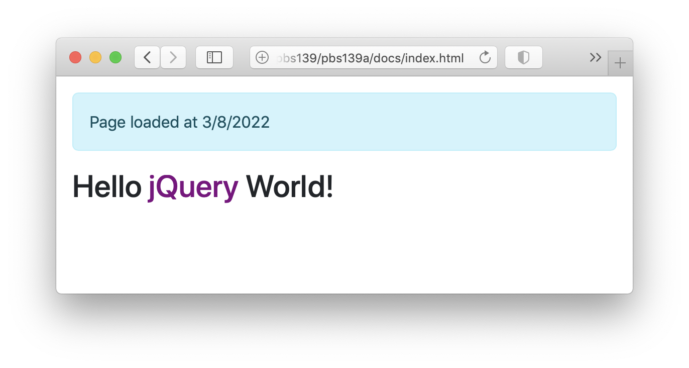
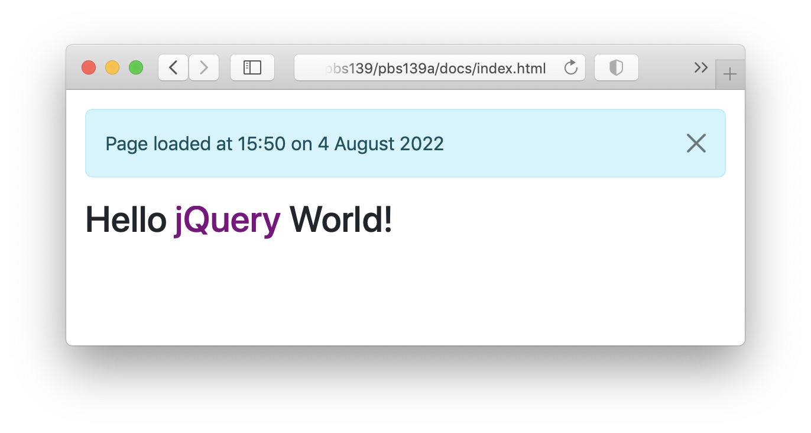
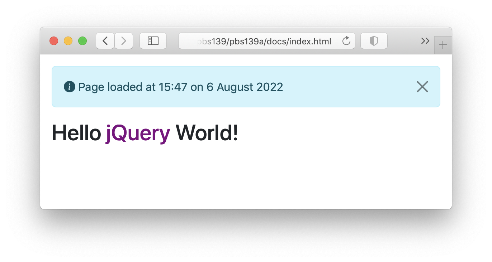
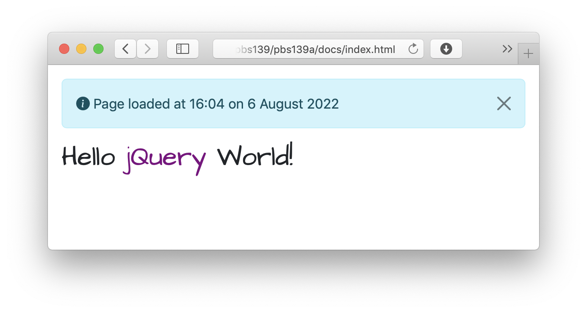

# PBS 139 of X — Bundling a Web App/Site with Webpack (Part 2)

Our [Webpack](https://webpack.js.org/) journey started with a look at how to use the tool to bundle a JavaScript library in [instalment 137](./pbs137). Then, in [the previous instalment](./pbs138) we introduced the concepts for using Webpack to bundle a web app or website, and made a good start on a worked example that already successfully bundled our own HTML, CSS & JavaScript, [jQuery](https://jquery.com/), [Luxon](https://moment.github.io/luxon/), and the [Bootstrap 5](https://getbootstrap.com/) CSS. In this instalment we'll pick up where we left off and add [Mustache templates](https://github.com/janl/mustache.js), Bootstrap 5 JavaScript, an icon font ([Bootstrap Icons](https://icons.getbootstrap.com/)), and a web font (from [Fontsource](https://fontsource.org/)) to our example app. That will give us a good broad sampling of the kinds of dependencies you're likely to need to bundle into your own projects.

Since we last used Bootstrap in the series it's gone from major version 4 to  5, so we'll take a pause to look at how JavaScript has changed in Bootstrap 5 as we bundle it into our example.

## Matching Podcast Episode

TO DO

## Episode Resources

* The instalment ZIP file — [pbs139.zip](https://github.com/bartificer/programming-by-stealth/raw/master/instalmentZips/pbs139)

## Continuing our Worked Example

At the end of the previous instalment our worked example had just had a Bootstrap Alert added that showed the time the page was loaded at. This alert was generated with jQuery, and used Luxon to generate the date information.

That code will form the starting point for this instalment, but with the instalment numbers incremented appropriately. You'll find this version of the app in the `pbs139a-startingPoint` folder in the instalment ZIP. To see the app in action open a terminal in the folder and run `npm ci && npm run build`, then open `docs/index.html` in your browser.



You'll find the finished final version of the code for this worked example in the folder `pbs139a` in this instalment's ZIP. You can see it in action by opening that folder in the terminal, running the same command as above, and opening the generated `docs/index.html` in your browser.

### Step 6 — Refactor the Alert to use a Mustache Template (as a Webpack Asset)

Our alert is currently quite intrusive, it really should be dismissible! [Bootstrap 5 supports dismissible alerts](https://getbootstrap.com/docs/5.2/components/alerts/#dismissing), but the functionality depends on the alert containing the markup for a close button. We could add more jQuery code to our existing document loader handler to add the content into the Alert, but it would be much easier if we could edit the markup for the alert in a separate file. This is literally what templates are for, so let's use this as a reason to learn how to use [Mustache templates](https://github.com/janl/mustache.js) in a Webpack world.

The first step is to install Mustache as a regular dependency:

```sh
npm install --save mustache
```

This is an overly simplified example, so we'll just be using one template file, but in a real-world project you'll be using many templates, so it makes sense to save the templates into a dedicated folder. To make our example realistic we'll save our template in the folder `src/templates`, and we'll use the file extension `.mustache` to make the Webpack config easier to write and understand.

Copy the `pbs139a-2/src/templates` folder from the instalment ZIP into your folder as `src/templates`. It contains just one file, `alert.html.mustache`, which is the template for our Alert:

```html
<p class="alert alert-info alert-dismissible">
    Page loaded at {{localTime}} on {{localDate}}
    <button type="button" class="btn-close" data-bs-dismiss="alert" aria-label="Close"></button>
</p>
```

Note that we've added the `alert-dismissable` class as well as a close button, and that we have two placeholders for data, `localTime` and `localDate`. Also note the use of a double-file extension, the final `.mustache` facilitates the Webpack config, and the preceding `.html` is to tell me how the template's contents will be interpreted. I.e. this template will be rendered to HTML for injection into the DOM, so I can use HTML tags, and should use double *'mustaches'* so that special characters get replaced with their HTML-escaped equivalents.

Remember that to use Mustache's `Mustache.render()` function we need two things, some template text, and the data that will be used to populate the fields in the template. Up until this point in the series we have been using `<script>` tags with IDs in our HTML markup to load our templates into our pages (for a detailed description see [instalment 73](./pbs73)). With Webpack 5's new [*Asset modules*](https://webpack.js.org/guides/asset-modules/) we can greatly simplify that import process.

You'll find an updated version of the Webpack config file (`webpack.config.js`) in the `pbs139a-2` folder in the instalment ZIP, copy this file into the root of your folder.

The only change in the file is the addition of a new rule in the `rules` array:

```js
{
  test: /\.mustache$/,
  type: 'asset/source'
}
```

This tells Webpack that any file ending in `.mustache` should be available for import into JavaScript as a *source asset*, i.e. the contents of the file should be read as a string.

With this config in place any Mustache template can be imported into and JavaScript file with an ES6 import statement of the form:

```js
const myTemplateString = import('./templates/myTemplate.type.moustache');
```

Note that the path is relative to the `entry` file configured in the Webpack config, i.e. relative to `src/index.js`.

You'll find an updated `index.js` file in the `pbs139a-2/src` folder, copy it into your `src` folder.

There are two changes in this file from the previous version. Firstly, we import both the Moustache module and our template near the top of the file:

```js
// import Mustache library & template
import Mustache from 'mustache';
import alertTpl from './templates/alert.html.mustache';
```

Again, note that the file path is relative to the entry point, i.e. `.` maps to `src`.

Secondly, the document ready event handler has been re-written to use Mustache to create the Alert:

```js
// a jQuery document ready handler
$(()=>{
    // update the greeting to show jQuery ran
    $('#world-modifier').text('jQuery');

    // build and add an alert with the loaded time
    const now = DateTime.now();
    const alertView = {
        localTime: now.toLocaleString(DateTime.TIME_SIMPLE),
        localDate: now.toLocaleString(DateTime.DATE_FULL)
    };
    const alertHTML = Mustache.render(alertTpl, alertView);
    $('.container').prepend(alertHTML);
});
```

If we now re-build our app by running `npm run build` we can now see our beautiful new alert:



Looks great, but what happens when you click the close button? Nothing 🙁 Why? Because we've not bundled Bootstrap's JavaScript yet!

### Step 7 — Import Bootstrap 5 JavaScript (& Bootstrap 5 JS Primer)

In previous instalments we've used Bootstrap 4, but as this instalment is being written (summer 2022), Bootstrap 5 is now the current stable release, so we'll be using that version in this worked example, and indeed in future instalments too. To understand the simple Bootstrap 5 code we'll be using to make our alert dismissible, let's take a brief pause to discuss Bootstrap 5's complete re-design of its JavaScript functionality.

#### Aside — JavaScript in Bootstrap 5

In terms of CSS there is not that much change between Bootstrap 4 and Bootstrap 5, but in terms of JavaScript, the change is fundamental — Bootstrap 4's JavaScript was implemented as a series of jQuery plugins while Bootstrap 5 doesn't use jQuery at all, and delivers all its JavaScript functionality as a collection of ES6 classes.

It is possible to import all of Bootstrap's classes into a single dictionary, but this is very inefficient, and not advisable for anything beyond quick and dirty prototyping. Don't ever do this in production code, but here's how you import all of Bootstrap 5's classes into a dictionary named `BS`:

```js
// for prototyping only, NEVER DO THIS IN PRODUCTION
import * as BS from 'bootstrap';
```

If you do this, you then access the individual classes as keys in the `BS` dictionary, so the `Alert` class would be `BS.Alert`, and so on.

The right way to import Boostrap 5 classes is to specify the list of classes you will be using within the `import` statement, so you only get what you need, e.g. to get just `Alert` and `Toast` classes use:

```js
import { Alert, Toast } from 'bootstrap';
```

As a general rule, the way you apply Bootstrap 5 JavaScript functionality to an HTML element is to call the constructor for the appropriate Bootstrap class with the native JavaScript DOM object as the first argument.

E.g. if you have a variable named `alertDOM` that contains a reference to a native JavaScript DOM object, then you can enable Bootstrap Alert functionality like a dismiss button by calling the `Alert` constructor like so:

```js
new Alert(alertDOM);
```

While Bootstrap no longer uses jQuery, we will be, so how do we use jQuery objects with Bootstrap 5? The key is to remember that jQuery objects are simply wrappers around zero or more native JavaScript DOM objects. To make the wrapping easy to remove when needed, jQuery objects are implemented as array-like objects where the array elements are the native DOM objects, so if the jQuery object `$alerts` represents three DIVs, the native DOM objects for those three DIVs will be `$alert[0]`, `$alert[1]` & `$alert[2]`.

#### Making our Alert Dismissible

With that explanation out of the way, let's update our JavaScript code to name our alert dismissible.

You'll find the updated `index.js` file in the folder `pbs139a-3/src`, copy that file over your existing `src/index.js`.

Now, let's look at the changes that were made to this file. Firstly, we added an import for just the Bootstrap 5 `Alert` class:

```js
// import specific Bootstrap JavaScript Modules (just Alert)
import { Alert } from 'bootstrap';
```

The only other change needed was to update the document ready handler to apply the Bootstrap functionality to our alert, this is the relevant section of code:

```js
// build and add an alert with the loaded time
const now = DateTime.now();
const alertView = {
    localTime: now.toLocaleString(DateTime.TIME_SIMPLE),
    localDate: now.toLocaleString(DateTime.DATE_FULL)
};
const alertHTML = Mustache.render(alertTpl, alertView); // generate the alert HTML
const $alert = $(alertHTML); // build a JQuery object from the HTML string
const alertDOM = $alert[0]; // extract the underlying native DOM object from the jQuery object
new Alert(alertDOM); // Apply the Bootstrap 5 Alert functionality to the DOM object
$('.container').prepend($alert); // inject the alert into the top of the container
```

I've added more variables with more explicit names and more comments than I normally would to make the entire process as clear as possible.

We use Mustache to generate the HTML for the alert as a string, then we build a jQuery object from that HTML string. Because jQuery objects are just wrappers around DOM objects, the `$()` function will create a DOM object for us. We can then access that DOM object as array index zero, i.e. the DOM object representing the array is `$alert[0]`. We use the DOM object to apply the Bootstrap functionality, then we inject the alert into the page using jQuery as we normally would.

To see our alert working as intended simply re-build with `npm run build`, refresh your browser window, and click the close button!

### Step 8 — Import a Glyphicon Font (Bootstrap Icons)

To bring any web app to life, it really helps to include icons in the controls and alerts. By far the easiest way to do that is with an icon font. In past instalments we've used Font Awesome for this, but their business model has changed, so as of the summer 2022, they are no longer my preferred free icon font. (FWIW they are still my preferred commercial icon font, and I retain my paid subscription for my own projects.)

While they maintain it as a separate project, the good folks at Bootstrap have released a free icon font they've branded as [Bootstrap Icons](https://icons.getbootstrap.com), and that's my current recommendation for easy to use free icons on the web.

To get started, first install Bootstrap Icons with NPM:

```sh
npm install --save bootstrap-icons
```

Before we can import these icons successfully we need to configure Webpack to bundle the relevant file extensions as data URLs, that way we don't end up with a sea of files cluttering our `docs` folder.

You'll find the updated `webpack.config.js` file in the `pbs139a-4` folder, copy it over your `webpack.config.js`.

The only meaningful change is the addition of a new rule for the file extensions used by the Bootstrap Icons, but I did also take the opportunity to add more comments to the file as it was starting to get quite long.

This is the relevant new rule:

```js
{
    test: /\.(woff|woff2|eot|ttf|otf)$/i,
    type: 'asset/inline'
}
```

The CSS for the icon font references files of various types, and this rule tells Webpack that when it meets those files, it should convert them to an *inline asset*, which is Webpack jargon for a data URL (see [instalment 23](./pbs23) for more on data URLs).

With that configuration in place we simply need to update our entry point to import the CSS for the icon font.

You'll find an updated version of `index.js` in the `pbs139a-4/src` folder, copy that over your `src/index.js`.

The only change in this new version of the file is an import statement to import the icon font:

```js
import 'bootstrap-icons/font/bootstrap-icons.css';
```

Note that in this case, the official docs for the icon font did not tell me the path to the CSS file, so I had to resort to Google to get the correct import path.

With that done we can now use any of the icons listed on [the Bootstrap Icons page](https://icons.getbootstrap.com/#icons). Let's update our alert template to include a traditional info icon.

You'll find an updated version of `alert.html.mustache` in the `pbs139a-4/src/templates` folder, replace your `src/templates/alert.html.mustache` with this file.

This is the new markup for the alert:

```html
<p class="alert alert-info alert-dismissible fade show">
    <i class="bi bi-info-circle-fill"></i>
    Page loaded at {{localTime}} on {{localDate}}
    <button type="button" class="btn-close" data-bs-dismiss="alert" aria-label="Close"></button>
</p>
```

The relevant part is the inclusion of the `<i>` tag as copied-and-pasted from [the Bootstrap Icons page describing our desired icon](https://icons.getbootstrap.com/icons/info-circle-fill/).

With all these changes in place we can re-build our app with `npm run build`, and then re-fresh our browser to see the updated alert:



### Step 9 — Import a Web Font

One way to give your site a little character is to use a font that's not one of the small set that are guaranteed to be installed everywhere. They way to do that is with a web font. Rather than manually installing fonts and managing them as assets ourselves, we can use NPM and Webpack to take care of all that for us.

The best resource I have found for getting nice free fonts via NPM is [Fontsource](https://fontsource.org). They have a very large library of free fonts, with each font distributed as a separate NPM package. For our example let's use the very pretty cursive font [Architects Daughter](https://fontsource.org/fonts/architects-daughter).

The fist step is to install the font via NPM:

```sh
npm install --save @fontsource/architects-daughter
```

Next, we need to import this module into our entry point.

You'll find an updated version of `index.js` in the `pbs139a-5/src` folder in the instalment ZIP, replace your `src/index.js` with this file.

The only change is importing the module:

```js
// import a nice handwriting web font
import "@fontsource/architects-daughter"
```

Next, we need to use this new font on our CSS. Let's use it for top-level headings.

You'll find an updated version of `index.css` in the `pbs139a-5/src` folder in the instalment ZIP, replace your `src/index.css` with this file.

The only change is the addition of a rule to apply the web font to all `<h1>` tags:

```css
h1{
    font-family: "Architects Daughter", cursive;
}
```

We can now re-built our app one last time with `npm run build`, then refresh our browser to see a very pretty hand-written greeting 🙂



## Final Thoughts

While this worked example doesn't do anything of value, it does use all the important parts of our programming toolkit, and it does so without over complicating things, making the Webpack functionality as obvious as possible. Webpack is an extremely powerful tool, and while we've covered the basics, it can do so much more. Hopefully you feel inspired to start using it in your own coding projects, and when you inevitably run into scenarios we've not covered, you should be armed with enough knowledge to search for a solution and understand the results. But don't forget that Allison has built an excellent community in the [NosillaCast Slack](https://podfeet.com/slack) with a channel dedicated to this series, so you can always share your questions there.