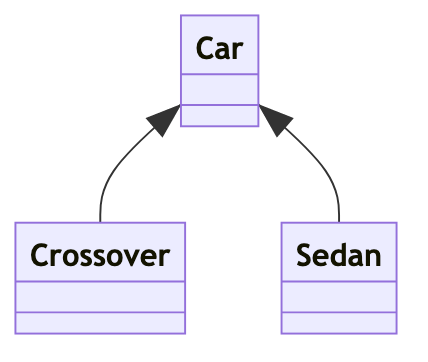
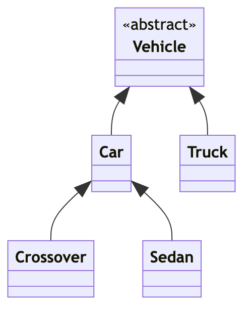
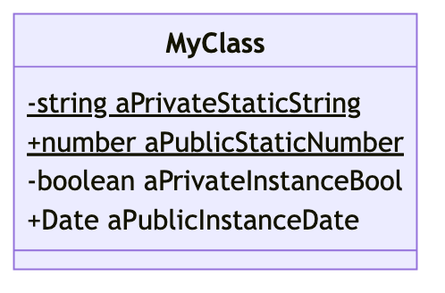
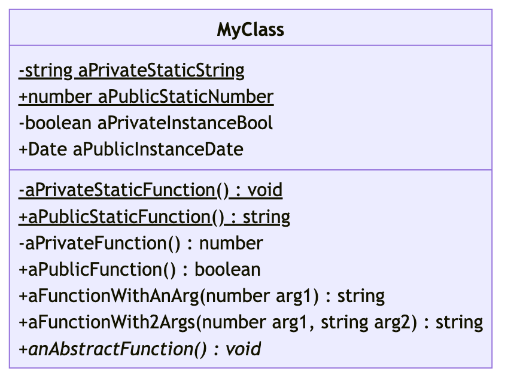

# PBS 140 of X — UML Class Diagrams

At this stage we have all the coding tools needed to port the [Crypt::HSXKPasswd Perl module](https://metacpan.org/pod/Crypt::HSXKPasswd) to JavaScript figured out — we know we'll be building the library in the NodeJS environment, using JSDoc to document it, using Jest to test it, and using WebPack to package it for publication.

Before we can start writing actual code we need to capture the design we'll be implementing in a standard way. We'll be producing API documentation with JSDoc as an output, so we obviously can't use that as our guide when building the first version of the code. We need to capture the requirements for version 1.0 in a way that's clear, and useful to developers. The documentation for the current Perl implementation will be helpful, but Perl and JavaScript are quite different languages, so the first step will be to translate the API from a collection of Perl modules into a collection of class definitions that can then be implemented in JavaScript.

It would certainly be possible to capture those class definitions in English, but that would be a horrendous chore, and the resulting wall of text wouldn't even be easy to use when coding. We need a better representation for the design — we need a diagram! We don't just need any diagram though, we need a diagram that adheres to industry standards so it's instantly understandable by any software engineer. In other words, we need a [UML class diagram](https://en.wikipedia.org/wiki/Class_diagram)!

## Matching Podcast Episode

TO DO

## Episode Resources

TO UPDATE

* The instalment ZIP file — [pbs139.zip](https://github.com/bartificer/programming-by-stealth/raw/master/instalmentZips/pbs139.zip)

## What Problem do UML Class Diagrams Solve?

The new XKPasswd API will be object oriented, so it will consist of a collection of JavaScript ES 6 classes. So, our design documents need to capture the classes that will be needed, the relationships between those classes, and the attributes and functions those classes must provide.

The act of creating the diagram will surface any implementation details that are Perl-specific, and force me to make decisions on how to transform those into a JavaScript-compatible design.

Once the diagram has been created it will act as a map to guide the coding work. The diagram will make it easy to find the right starting place — the classes that don't depend on any other classes — and then to work through the dependencies in an order that will allow the code to be functional and testable every step of the way. The diagram will also act as a glanceable quick reference for the details of all functions and attributes that need to be added to the classes.

## What are UML Class Diagrams?

[UML is the *Unified Modeling Language*](https://en.wikipedia.org/wiki/Unified_Modeling_Language), and the spec defines many different diagram types, not just the [UML Class Diagrams](https://en.wikipedia.org/wiki/Class_diagram) we're focusing on in this instalment. The entire UML spec is designed to be language agnostic, so I like to think of UML diagrams as **pseudo-code in pictures**. Because the spec is language agnostic, it's very broad, covering all possible features in all possible languages. I doubt any single human is intimately familiar with the entire spec, so it's entirely expected that you pick and choose the parts you need, and ignore the rest (which is exactly what we'll be doing in this instalment 🙂).

We'll be limiting our exploration of UML to just class diagrams, and our explorations of class diagrams to just:

1. The *Aggregation*, *Composition*, and *Inheritance* class relationships
2. The *Abstract* class *Annotation*
3. Class *Members* (attributes & functions)

### The Basics

As its name suggests, class diagrams show the classes that will make up your code, so classes are the atoms of class diagrams. Each class is represented as a box with three vertically stacked segments:

1. The class name in bold and centered text and any class annotations
2. The list of instance and static attributes, with static attributes underlined
3. The list of instance and static functions again, with static functions underlined

The relationships between classes are represented by arrows with differently shaped heads and optional cardinalities on each end. Cardinality is the number of elements in a set. 

When building out an object oriented design, you generally start by creating empty boxes for all the classes you can think of, then you start defining the relationships between them, and only then do you start adding the detail to your classes. So, let's structure our exploration in the same way.

### The *Inheritance* Class Relationship

The simplest relationship to understand is inheritance. In modern JavaScript, inheritance is implemented with the `extends` keyword, so if you have one class that extends another, you have an inheritance relationship.

Inheritance is used to import, well, inherit really, the functionality from one class into another, and then add more. The class being inherited from is generally referred to as the *parent* and the classes that do the inheriting as *child classes*.

In UML class diagrams, **inheritance is represented by a solid line with a filled triangular arrow at the parent class**. For example, both `Crossover` and `Sedan` extend the class `Car`:

The inheritance relationship is often referred to as the *is a* relationship. In this case, a crossover is a car, and a sedan is a car.

### Abstract Classes

Often, when you're designing your classes you'll notice you have a lot of duplication between classes representing similar things. You can move this common functionality into a new class and then have the original classes inherit from your new class. Often when you do this your new class will represent an abstract concept, so it wouldn't make sense to be able to create instances of that class. For example, it makes sense to have instances of `Car`, and `Truck` classes, but not `Vehicle`. You want to insist that the `Vehicle` class be extended to be used, and you do that by marking the `Vehicle` class as *abstract*. 

Note that many languages use the `abstract` keyword to enforce abstractness, but JavaScript doesn't have this feature, so when coding in JavaScript you can either trust users of your code to obey your documentation and not try to create instances of the classes you mark as abstract or, you can make the constructors for those classes throw exceptions.

Anyway, in UML Class Diagrams, abstractness is indicated by adding `abstract` as a so-called *class annotation*. This annotation is double-chevron-wrapped text above the class name, as shown in the following example:

### The *Aggregation* & *Composition* Class Relationships

I find these two relationships the most challenging to keep straight in my head when interpreting UML class diagrams I didn't create. I find it difficult to remember which side of the relationship the arrow head goes on, and how to read the optional cardinalities on the two ends of the line. The fact that the difference between these two relationships is very abstract doesn't help either!

Both of these relationships are flavours of what we have been referring to as the *has a* relationship throughout this series. The difference is down to the depth of the relationship. The difference between the two relationships comes down to the answer to a simple question — **if I delete an instance of the containing class, do the instances of the contained class get deleted too, or do they still make sense existing independently?** 

* If they don't make sense on their own, the relationship is *compositional*
* If they do make sense on their own, it's an *aggregation*. 

An everyday example would be a class representing a person that contains tattoos and wedding rings. When people die the tattoos go away, but the wedding rings remain, so tattoos have a compositional relationship to people, while rings have an aggregational relationship.

In UML class diagrams, these relationships are represented with solid lines with diamond arrow heads on the side of the class acting as the container. If the relationship is compositional the diamond is filled, if its an aggregation the diamond is just an outline:

As a trained scientist, my preferred example is classes to represent atoms. Atoms contain some amount of nucleons (protons & neutrons), and some amount of electrons. Atoms lose and gain electrons all the time, and when you split an atom the protons and neutrons continue to exist on their own and can be rearranged into new atoms. This means there's an aggregation relationship between atoms & nucleons and atoms & electrons.

The electrons are fundamental, but the nucleons are not — they're made up of quarks. Those quarks are very different to electrons though — they can't exist on their own — so they have a compositional relationship to the nucleons.

Both being nucleons, protons and neutrons work very similarly at a physical level, so it makes sense to capture their common behaviours in a parent class. In the real world you always have a proton or a neutron, you never have a nucleon that's not a proton or a neutron, so the nucleon class is  abstract.

Putting it all together we now have a nice real-world example:

This diagram gives us a good idea of the broad relationships between atoms, electrons, protons, and neutrons, but it doesn't capture a very important aspect of these relationships — their *cardinality*. How many electrons and nucleons do atoms contain, and how many quarks are there in a nucleon?

UML class diagrams allow cardinalities to be added to relationships with annotations on the ends of the lines representing compositional and aggregation relationships. The supported annotations include:

* `*` — any number (zero or more)
* `x` — exactly that number
* `x..*` — at least `x`, e.g. `2..*` — at least two
* `x..y`, — at least `x` and at most `y`, e.g. `2..4` — two to four inclusive

There are two cardinalities for each relationship — one from each side's POV. To illustrate this point, let's look at the relationships in our atom example:

1. Each quark belongs to exactly one nucleon, and each nucleon has exactly 3 quarks.
2. Each nucleon belongs to zero or one atom, and each atom has one or more nucleons.
3. Each electron belongs to zero, one, or more atoms (electrons can exist on their own, can be bound to a single atom, or can be shared between atoms to form chemical bonds). Atoms can also have zero or more electrons.

When adding cardinalities to relationships in UML class diagrams the label goes at the **far end** of the line. From a nucleon's point of view it belongs to zero or one atom, so the `0..1` goes on the side of the line furthest from it, i.e., the `Atom` side. I find this **very counter intuitive**, but it is what it is, and I seem to need to re-read the docs every other month to keep is straight in my head!

Putting it all together we get the following class diagram showing relationships of all three kinds, cardinalities, and an abstract class:

### Class Members (Attributes & Functions)

Now that we know how to show relationships between classes, let's look at how to add detail to classes. The UML spec refers to anything a class contains as a *member*, and uses the term *attribute* for class and instance variables, and *function* for all function-like things, including methods in languages that distinguish between functions and methods (which JavaScript does not).

As mentioned earlier, a class is represented as a vertical stack of three boxes. We already know the top box is for the class name and perhaps an optional annotation, so let's move down one box. The middle box is where the *attributes* (AKA *properties* or *variables*) go. The simplest representation supported is a list of names, one per line, but more information can be added.

The name can be prefixed with a symbol to indicate its visibility. For our purposes we'll just be using two of the possible symbols:

1. `-` indicates a private attribute
2. `+` indicates a public attribute

Finally, any static attributes (class variables) will be underlined.

Putting it all together, we get something like:

Functions appear in the bottom box and are very similar to attributes, but with parentheses after the names. Like attributes, functions are prefixed with `-` or `+` to indicate their visibility, and static functions are underlined. Return types can be optionally added to the end of functions by separating them from the function's definition with colon (`:`). You can indicate that a function doesn't return a value by specifying the special return type `void`.

You can also show a functions arguments by adding them between the parenthesis. In loosely types languages you can simply specify the arguments as a coma-separated list of names, but with languages that have a concept of types, those can be added before the names and separated from them with spaces. 

Finally, a function can be marked as abstract (cannot be called on the parent class and must be added to every child class) by making it italic.

Putting all that together we get one final version of our example class:

## Final Thoughts

Hopefully, I've demonstrated how information-rich and yet easy-to-read UML class diagrams are and whetted your appetite for using them, or at the very least given you enough of an understanding to interpret them when you come across them in software engineering books, blog posts, or API documentation.

It probably comes as no surprise that many diagramming tools have templates/presets/themes/pallets for creating UML diagrams. But it might surprise you to learn that there is a markup language that can be used to define class diagrams in plain text! The idea is that you code your diagrams like you do everything else in your software project, and then use a tool to automatically convert the text to images. This means developers don't need to learn diagramming apps, and you get full version control over the contents of your diagrams through your regular source control systems (Git in our case).

You've probably already guessed that all the diagrams in this instalment were created from plain text [Mermaid](https://mermaid-js.github.io/mermaid/#/classDiagram) files and converted to PNGs using the [Mermaid CLI](https://www.npmjs.com/package/@mermaid-js/mermaid-cli). If you want to learn how to do the same, stay tuned, that's what the next instalment will be all about 🙂

Allison talked about Mermaid on the NosillaCast a year ago when she explained the capabilities of the open source, cross-platform notebook app Joplin: [www.podfeet.com/...](https://www.podfeet.com/blog/2021/08/joplin-part-2/)

